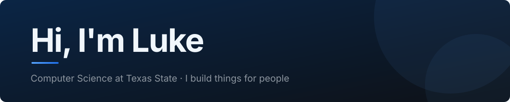
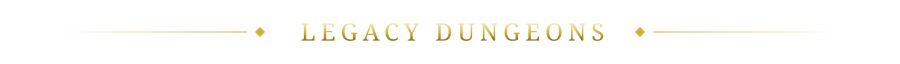
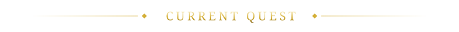
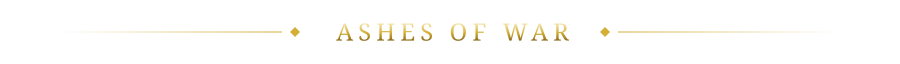
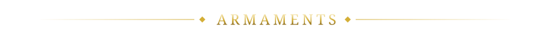
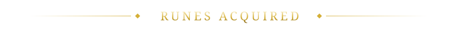
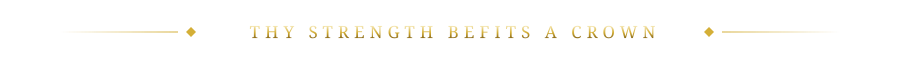

  

  

I like building things for people.

A network of daily guessing games, played by thousands of people every day.

| Game | Domain | Description |
|---|---|---|
| **[Rivaldle](https://rivaldle.com)** | rivaldle.com | Guess the daily Marvel Rivals hero. |
| **[SoulsDoku](https://soulsdoku.com)** | soulsdoku.com | A daily grid puzzle of Souls-series bosses. |
| **[Chainsaw Man-dle](https://chainsawmandle.com)** | chainsawmandle.com | Guess the daily Chainsaw Man character. |
| **MCUdle** | coming soon | Guess the daily MCU character. |

**Locturne**: an iOS app that puts your apps to sleep at bedtime and keeps them asleep until you get out of bed.

| Project | Description |
|---|---|
| **[QuizGarden](https://github.com/llyons151/QuizGarden)** | Turns your notes into quizzes. |
| **[ParticleStuff](https://github.com/llyons151/ParticleStuff)** | Particle simulation in C++ and OpenGL. |
| **[PongAI](https://github.com/llyons151/PongAI)** | An AI that learns to play Pong. |
| **[Skyward Suspicion](https://github.com/llyons151/Skyward-Suspicion)** | A detective game in the terminal. |

  

<picture>
  <source media="(prefers-color-scheme: dark)" srcset="https://raw.githubusercontent.com/llyons151/llyons151/output/snake-dark.svg" />
  <source media="(prefers-color-scheme: light)" srcset="https://raw.githubusercontent.com/llyons151/llyons151/output/snake.svg" />
  
</picture>

